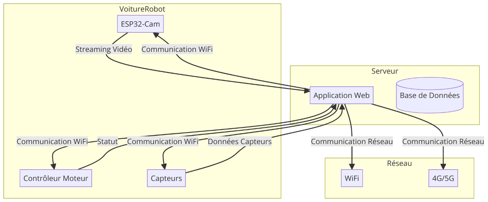
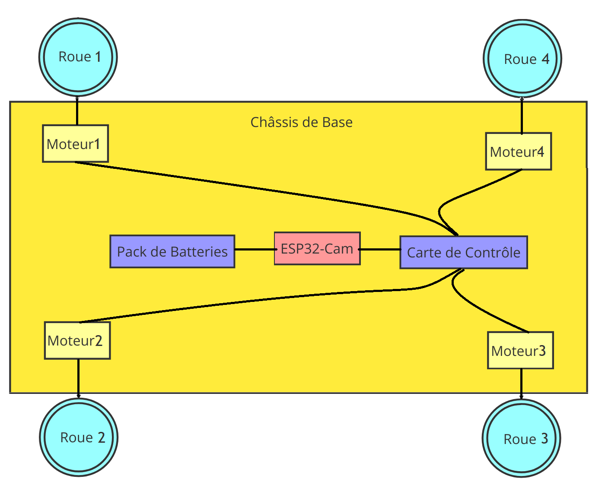
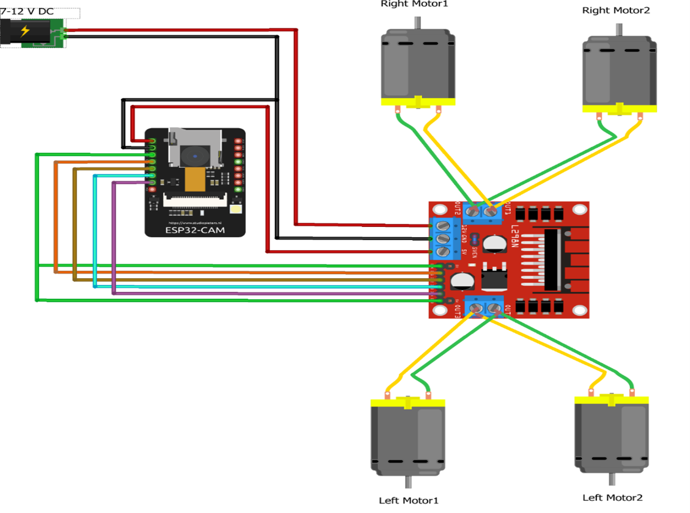
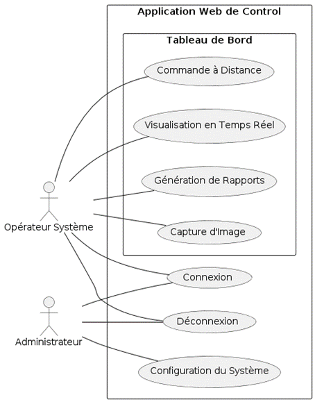
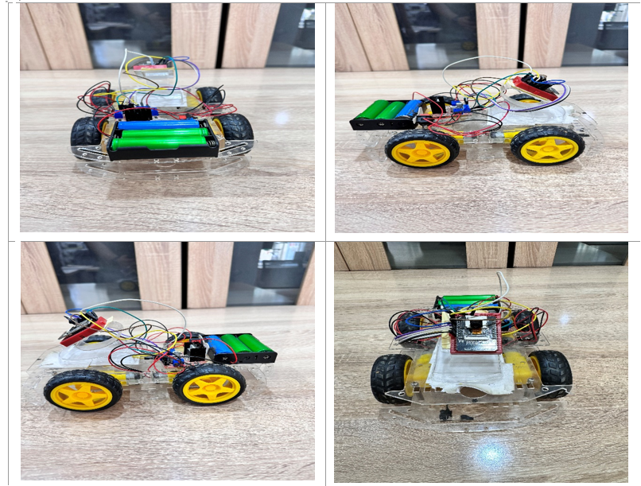
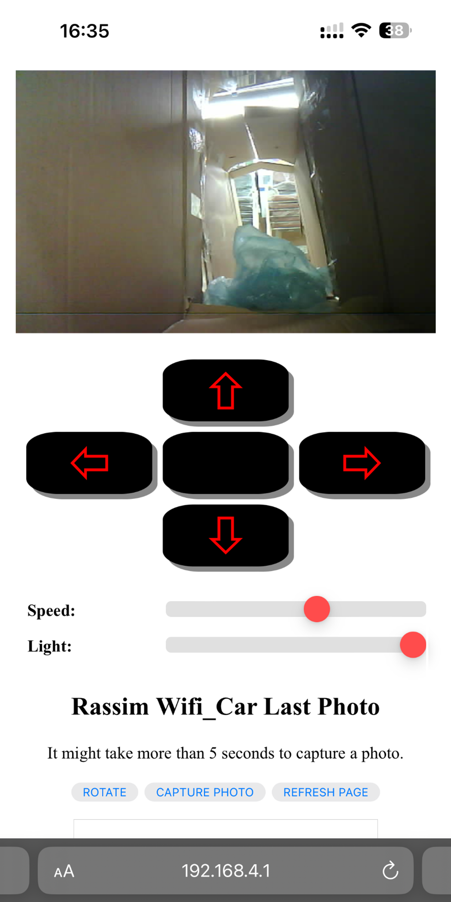
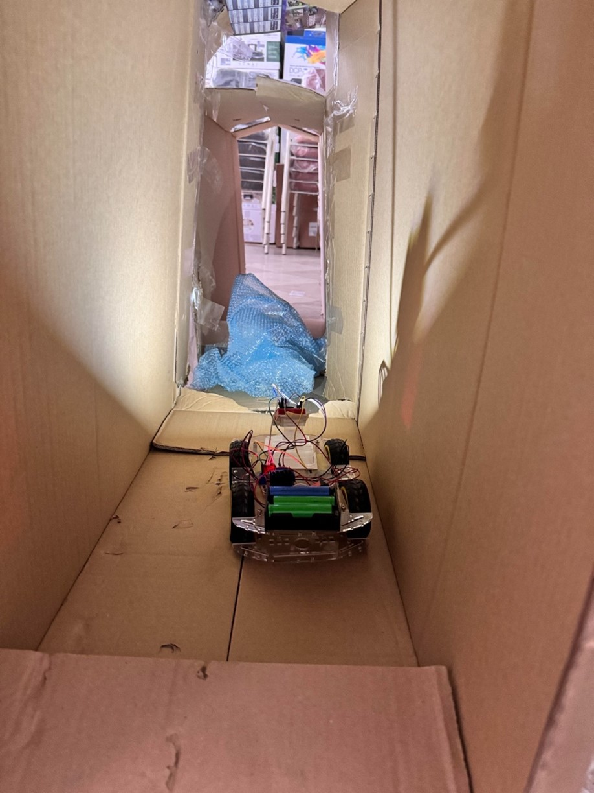

### README for GitHub Repository

# ESP32Cam_RobotCar

A complete project for an obstacle detection system using an ESP32-CAM Robot-Car. Includes detailed schematics, microcontroller code, and a web app for remote control and real-time monitoring. Ideal for urban sanitation and infrastructure maintenance.

## Table of Contents

- [Introduction](#introduction)
- [Features](#features)
- [System Architecture](#system-architecture)
- [Getting Started](#getting-started)
  - [Prerequisites](#prerequisites)
  - [Installation](#installation)
- [Hardware Setup](#hardware-setup)
- [Software Setup](#software-setup)
  - [Microcontroller Code](#microcontroller-code)
  - [Web Application](#web-application)
- [Usage](#usage)
- [Testing](#testing)
- [Limitations](#limitations)
- [Future Work](#future-work)
- [Contributing](#contributing)
- [License](#license)

## Introduction

This repository contains the complete project for an obstacle detection system using an ESP32-CAM based robot car. It is designed to navigate through narrow paths and detect obstacles, making it ideal for urban sanitation and infrastructure maintenance.

## Features

- Real-time video streaming from ESP32-CAM
- Remote control via web application
- Obstacle detection and avoidance
- Data logging and reporting

## System Architecture

Below are important figures illustrating the system architecture and the actual robot car.

### System Architecture Diagram

This diagram shows the overall architecture of the ESP32-CAM Robot-Car system, including the connections between the ESP32-CAM module, motor driver, and other components.



### Chassis Design

The chassis design image showcases the structural layout of the robot car, detailing how the various components are mounted and secured.




### Electronic Schematic

This schematic provides a detailed view of the electronic connections within the robot car, including the ESP32-CAM, motor driver, and other essential components.



### Use Case Diagram

The use case diagram illustrates the interactions between the user and the robot car, highlighting key functionalities such as remote control, real-time monitoring, and data logging.



### Real Robot-Car

This image shows the completed robot car with all components assembled, ready for testing and deployment.



## Getting Started

### Prerequisites

- ESP32-CAM module
- Motor driver module
- DC motors and wheels
- Power supply
- Arduino IDE
- Basic knowledge of electronics and programming

### Installation

1. Clone the repository:
   ```sh
   git clone https://github.com/yourusername/ESP32Cam_RobotCar.git
   ```
2. Open the Arduino IDE and install the ESP32 board package.
3. Install required libraries:
   ```sh
   Arduino libraries: WiFi, ESPAsyncWebServer, AsyncTCP, etc.
   ```

## Hardware Setup

1. Assemble the robot car with the ESP32-CAM module, motor driver, and DC motors.
2. Connect the components as per the provided schematic diagram.
3. Ensure the power supply is properly connected to all components.

## Software Setup

### Microcontroller Code

1. Open `ESP32Cam_RobotCar.ino` in Arduino IDE.
2. Configure your WiFi credentials in the code:
   ```cpp
   const char* ssid = "your_SSID";
   const char* password = "your_PASSWORD";
   ```
3. Upload the code to the ESP32-CAM module.

### Web Application

1. The web application files are located in the same `ESP32Cam_RobotCar.ino` directory.
2. Access the web application through the provided URL to control and monitor the robot car.



## Usage

1. Power on the robot car and ensure it connects to the WiFi network.
2. Open the web application and start controlling the robot car.
3. Monitor the video stream and navigate the robot through various environments.

## Testing

1. Test the robot car in a simulated environment with obstacles.
2. Record the performance and make necessary adjustments.
3. Validate the obstacle detection and avoidance mechanisms.



## Limitations

- Sensitivity to light variations
- Connectivity issues in certain environments
- Limited battery life

## Future Work

- Improve obstacle detection algorithms
- Enhance robustness of the system
- Expand testing to more complex environments

## Contributing

Contributions are welcome! Please fork the repository and submit pull requests for any enhancements or bug fixes.

## License

This project is licensed under the License. See the `LICENSE` file for more details.

---

This detailed README provides a comprehensive overview of the project, including setup instructions, features, usage guidelines, and important figures to ensure users can easily get started and contribute to the project.
